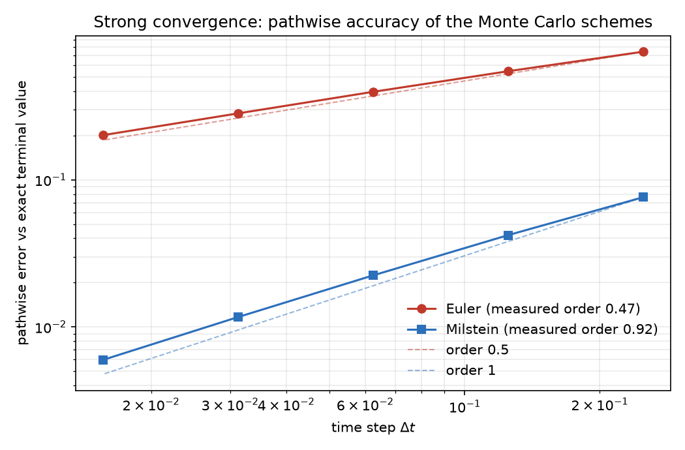
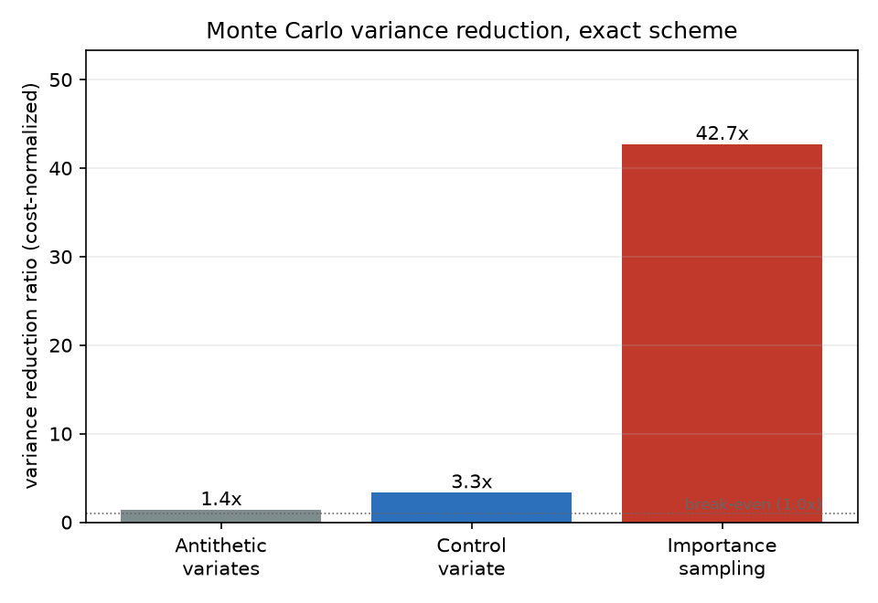

# Numerical pricing and model validation

[](https://github.com/wididestrianda01/pricing-model-validation/actions)
[](https://www.python.org/downloads/)
[](LICENSE)

A derivatives-pricing core built from first principles and validated the way a
model-validation team would validate it. Every numerical method is implemented
from scratch, then checked against a challenger that shares nothing with it: a
closed form, QuantLib, or a second independent engine. The portfolio is
documented in an SR 26-2 validation memo with per-component verdicts, and
every number reproduces from one offline command.

A bank does not trust a pricing model because it returns a number. It trusts
the model because an independent team re-priced the same instrument another
way and got the same number. This repository plays both roles.

## Results at a glance

Every row is the output of a deterministic, seeded run committed to the repo,
with an acceptance bar and a pass/fail verdict. See `docs/validation-report.md`
and `data/processed/evidence_tables.csv`.

| Result | Measured | Acceptance bar |
| --- | --- | --- |
| Anchor agreement: LSM Monte Carlo vs Crank-Nicolson PDE (Bermudan swaption) | 0.22% | two independent engines agree within 2% |
| FRTB PLA rank correlation (Spearman) | 1.000 | > 0.80 |
| FRTB PLA distribution distance (KS) | 0.075 | < 0.09 |
| Variance reduction, importance sampling (deep OTM call) | 41.7x | > 1x |
| Variance reduction, control variate | 3.3x | > 1x |
| Monte Carlo weak order, Euler / Milstein | 1.29 / 1.43 | in [0.6, 1.5] |
| Monte Carlo strong order, Milstein / Euler | 0.92 / 0.47 | in [0.8, 1.2] / [0.35, 0.65] |
| Greeks vs closed forms, all four estimators (delta / vega) | within 0.5% | < 5% / < 15% |
| PDE convergence order, Crank-Nicolson (space / time) | 2.62 / 2.16 | second order |
| Acceptance bars passed | 30 / 30 | all |

## What it contains

- **Monte Carlo engine** — Euler, Milstein, and exact schemes with measured
  weak and strong convergence orders and standard-error scaling at
  `1 / sqrt(N)`; antithetic, control-variate, and importance-sampling variance
  reduction, each checked to stay unbiased with a measured variance ratio; and
  scrambled Sobol quasi-Monte Carlo.
- **Greeks engine** — bump-and-reprice, pathwise, likelihood-ratio, and JAX
  autodiff pathwise estimators, all cross-checked against closed forms within
  0.5%; the bump-size bias-variance tradeoff is quantified.
- **Finite-difference PDE engine** — explicit, implicit, and Crank-Nicolson
  schemes with measured stability regions and convergence order 2; Richardson
  extrapolation, ADI, projected SOR, and Longstaff-Schwartz for early
  exercise. Order degradation on digital, barrier, and free-boundary payoffs
  is documented rather than hidden.
- **The anchor** — one Bermudan swaption under Hull-White carried end to end:
  priced by LSM Monte Carlo and by Crank-Nicolson PDE (agreement 0.22%),
  benchmarked against Jamshidian's decomposition and QuantLib, and hedged
  with delta/vega Greeks that pass the FRTB PLA consistency bar.
- **Calibration** — SABR and Heston calibrated to a committed real SPX option
  snapshot plus an 84-date SPY SABR backtest (2019-2025); synthetic surfaces
  with known parameters prove the fitters first.
- **Validation report** — `docs/validation-report.md`: SR 26-2 structure,
  green/amber/red scorecard, and a findings ledger with severities and
  remediations.





## Reading the results

**The convergence plot.** Each line is the absolute pathwise error of a scheme
plotted against the time step on a log-log scale. On that scale a line with
slope `p` means the error falls as `dt^p`, so the slope is the measured
convergence order. Euler lands near the order-0.5 reference and Milstein near
the order-1 reference, and the measured slopes (0.47 and 0.92) sit close to
their theoretical values. The vertical gap between the lines is the reason the
choice of scheme matters: at the finest step Milstein is about an order of
magnitude more accurate than Euler for the same number of paths. The orders
are estimates from a fixed path count; more paths would push them closer to
0.5 and 1, but the committed run keeps enough paths to separate the two
schemes cleanly.

**The variance-reduction plot.** Each bar is the cost-normalized variance
ratio of a technique: the variance of the naive estimator divided by the
variance of the reduced estimator, with the extra path cost of the technique
factored in. A ratio above 1 means the technique pays for itself. Antithetic
variates give 1.4x on the at-the-money call, the control variate gives 3.3x,
and importance sampling gives 41.7x on the deep out-of-the-money call, where
the naive estimator spends most of its paths on payoff values that contribute
almost nothing to the price. A ratio of 41.7x means roughly 42 times fewer
paths are needed to reach the same standard error.

**The results table.** Every row is one metric from the committed evidence
table, paired with the acceptance bar a validator would enforce and the
measured value; pass means the value is inside the bar. Two rows reward close
reading. The FRTB PLA pair passes with thin KS headroom (0.075 against a 0.09
bar), which the findings ledger records as a limitation of a first-order hedge,
not a clean bill of health. The 0.22% anchor disagreement is the difference
between two engines that share no code, which is the point of the exercise.
The scorecard in `docs/validation-report.md` rates every component green,
amber, or red and lists each limitation as a finding with a remediation.

## Reproduce everything

```bash
uv sync                          # locked environment, fixed seeds
uv run python scripts/run_all.py # all experiments, offline (~20 s)
uv run pytest -q                 # 165 tests (~2 min; first run compiles Numba kernels)
```

The run writes `data/processed/run_manifest.json` (environment versions,
input checksums, runtimes, metrics) and `data/processed/evidence_tables.csv`
(metric vs acceptance bar vs verdict). Two consecutive runs produce identical
numbers. Raw market data stays out of the repo (gitignored, checksummed in
`data/manifest.json`); the processed snapshots the pipeline consumes are
committed, so nothing after the initial fetch touches the network.

The figures above regenerate from the same experiments:

```bash
uv run python scripts/make_figures.py
```

## Layout

```
src/pricing/
  benchmarks/      closed forms + QuantLib challengers (the testing seam)
  monte_carlo/     engine, convergence studies, variance reduction, QMC
  greeks/          FD bump, pathwise, LR, JAX pathwise + validation studies
  pde/             schemes, ADI, PSOR, LSM, convergence studies
  anchor/          Bermudan swaption instrument, LSM + PDE engines, PLA leg
  calibration/     implied vol, SABR, Heston, snapshot + backtest pipelines
  validation/      one-command pipeline + evidence tables
docs/               validation report, anchor memo, data sources, runbook,
                    ADRs, domain language, technical reference
tests/              pytest suite asserting behavior against independent benchmarks
```

Stack: Python 3.12, NumPy/SciPy/pandas, Numba for inner loops, JAX only for
autodiff pathwise Greeks, and QuantLib-Python as the independent benchmark.
See `docs/runbook.md` for operation and thresholds, `docs/validation-report.md`
for what was approved and why, and `docs/reference/` for the theory behind the
methods.

## License

MIT. See [LICENSE](LICENSE).
